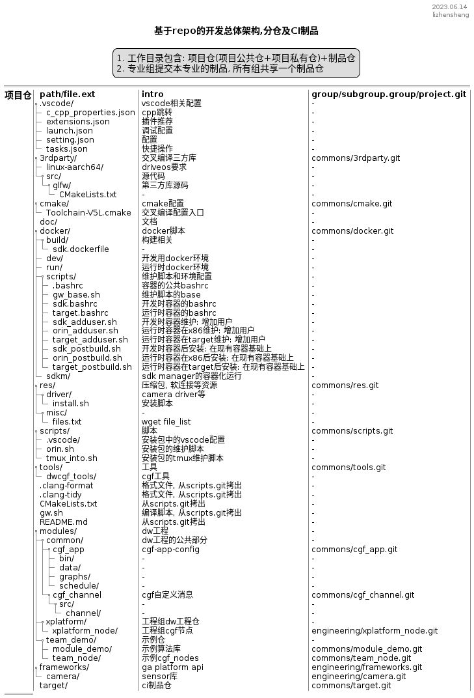
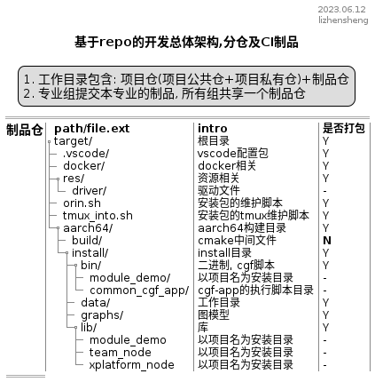
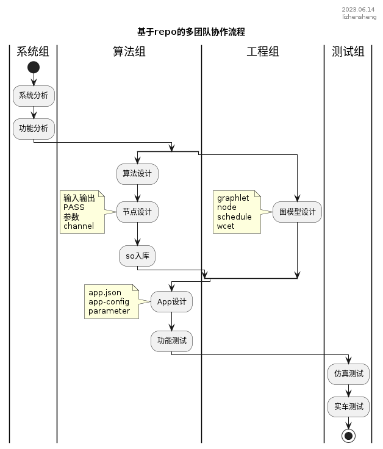

# nv_driveworks_demo

## 简介

driveworks开发demo

- 上位机docker编译环境
- 上位机docker运行调试环境
- 上位机docker交叉编译环境
- 目标机orin部署环境
- 目标机orin远程调试环境

## 获取代码

P.S. 若有权限问题

```sh
chmod +x -R ./docker/
chmod +x -R ./scripts/
```

## docker环境

### sdk-docker

```sh
docker load -i ./drive-sdk-docker-6.0.6.tar
docker pull nvcr.io/drive/driveos-sdk/drive-agx-orin-linux-aarch64-sdk-build-x86
# nvcr.io/drive/driveos-sdk/drive-agx-orin-linux-aarch64-sdk-build-x86   6.0.6.0-0004               2a61be9dd0a0   8 weeks ago    54.1GB
# 启动docker, 容器名称为gw_sdk_20.04_${USER}
./docker/dev/sdk_start.sh
# 进入container
./docker/dev/sdk_into.sh
# 额外安装软件
./docker/scripts/sdk_postbuild.sh
```

### orin-docker

运行时docker在x86平台构建

```sh
docker load -i ./arm64v8-ros-foxy-dev.tar
docker pull arm64v8/ros:foxy-dev
# 启动docker, 容器名称为gw_orin_20.04_${USER}
./docker/dev/orin_start.sh
# 进入container
./docker/dev/orin_into.sh
# 额外安装软件
./docker/scripts/orin_postbuild.sh
```

### target-docker

运行时docker在orin平台运行 <https://developer.nvidia.com/blog/running-docker-containers-directly-on-nvidia-drive-agx-orin/>

```sh
docker load -i ./arm64v8-ros-foxy-dev.tar
docker pull arm64v8/ros:foxy-dev
# 启动docker, 容器名称为gw_orin_20.04_${USER}
./docker/run/orin_start.sh
# 进入container
./docker/run/orin_into.sh
# 额外安装软件
./docker/scripts/target_postbuild.sh
```

## 构建

### 本地编译

cmake的使用参考<https://manpages.ubuntu.com/manpages/bionic/man1/cmake.1.html>

```sh
cd gw_demo
./gw.sh cmake_x86
./gw.sh make_x86
./gw.sh install_x86
# clean
./gw.sh clean
```

### 交叉编译

- 构建目录设置到`target`目录，`target` 目录拷贝到目标机器

```sh
cd gw_demo
./gw.sh cmake_aarch64
./gw.sh make_aarch64
./gw.sh install_aarch64
# clean
./gw.sh clean
```

### 交叉编译ROS2包

- 构建目录设置到`target`目录，`target` 目录拷贝到目标机器

```sh
cd gw_demo
./gw_ros.sh build_rel
# clean
./gw_ros.sh clean
```

## vscode编译配置

### tasks

已经配置好`./.vscode/tasks.json`，和`./scripts/.vscode/tasks.json`可通过task实现快捷操作

使用方式为：`Ctrl+Shift+P` + `Tasks: Run Task` + `选择具体的task`

### cpp开发支持

安装cpp插件，编辑`./.vscode/c_cpp_properties.json` 设置driveworks和driveos的目录，即可跳转。

安装cmake-tools插件，即可获得完整cmake开发体验。

### 错误查看和跳转

为了实现查看错误跳转，创建一些软连接

```sh
# in host
ln -s $PWD ./gw_demo
sudo ln -s $PWD /gw_demo
# to use dwcgf-tools out of docker
sudo ln -s ~/orin_ws/nv_driveworks/driverorks-5.10/ /usr/local/driveworks-5.10
sudo ln -s /usr/local/driveworks-5.10 /usr/local/driveworks
```

## 运行

### 普通app

以`module_demo`库的测试app为例

```sh
cd /target/aarch64/install/
./bin/module_demo/module_demo_main
```

### helloworld-cgf

以`Helloworld`为例

```sh
cd /target/aarch64/install/
sudo ./bin/common_cgf_app/runHelloworld.sh
# 删除日志
./orin.sh clean
# 查看日志
tail -n 50 -f ./LogFolder/common_cgf_app/Helloworld/helloworld_process0_0.log
```

### sensor-cgf

以`VirtualCameraDeployPipe`为例

```sh
# prepare res
ln -s ~/myz/data/video ./aarch64/install/data/common_cgf_app/video
cd ./aarch64/install/
sudo ./bin/common_cgf_app/runVirtualCameraDeployPipe.sh
```

## 高级使用

以下为实验性，增强型功能，需要自行修改适配后使用

### ros2

```sh
# source prebuilt ros2 env
source ./docker/scripts/target.bashrc
# source the current project ros2 env
source ./colcon/install/local_setup.bash
```

### tmux

tmux是一款好用的工具，此处tmux脚本仅供运行时target-orin-docker使用。

```sh
# in host
cd /target
./tmux_into.sh
# close the tmux
tmux kill-session -t target_tmux_into
```

## 调试

### debug编译

由于设置了`set(CMAKE_DEBUG_POSTFIX _d)`, 所有debug lib都添加后缀`_d`

修改`./gw.sh` 相关命令，手动添加`-DCMAKE_BUILD_TYPE=Debug`

```sh
function cmake_aarch64() {
  info "Start cmake, please wait ..."
  info "cmake on $MACHINE_ARCH..."

  cd ${GW_ROOT_DIR}
  info "cmake -B ${GW_AARCH64_BUILD_DIR} ${CMAKE_BUILD_OPT} ${CMAKE_CROSS_OPT} -DCMAKE_BUILD_TYPE=Debug"
  cmake -B ${GW_AARCH64_BUILD_DIR} ${CMAKE_BUILD_OPT} ${CMAKE_CROSS_OPT} -DCMAKE_BUILD_TYPE=Debug

  if [ ${PIPESTATUS[0]} -ne 0 ]; then
    fail 'cmake failed!'
  fi
  info "please make_aarch64"
  cd -
  success 'cmake_aarch64 passed!'
}
```

### 开发时调试(x86)

todo:

### 远程调试(aarch64)

见 `./.vscode/launch.json`

### 运行时调试(aarch64)

见`./scripts/.vscode/launch.json`

## 架构

### 构建架构

内部代号：gaworks, 开发代号gw, GW



### 运行架构

制品目录也提交入库



### 开发流程



## 已知问题

### docker环境问题

- [x] docker环境下terminal没有彩色输出(已解决 -e TERM=xterm-256color)
- [x] docker环境下terminal apt安装不能tab (<https://askubuntu.com/questions/735189/enabling-auto-completion-for-apt-get-install-in-docker-ubuntu-14-04>)
- [x] docker环境下不能启动界面? (已解决 -e DISPLAY)
